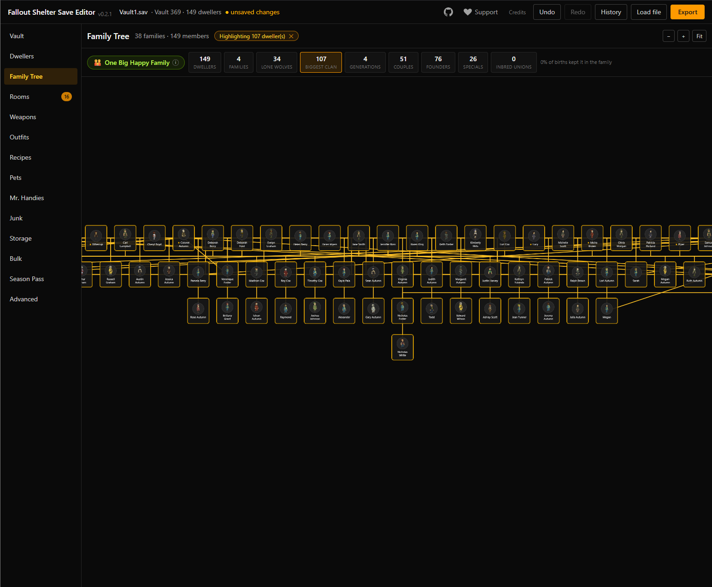
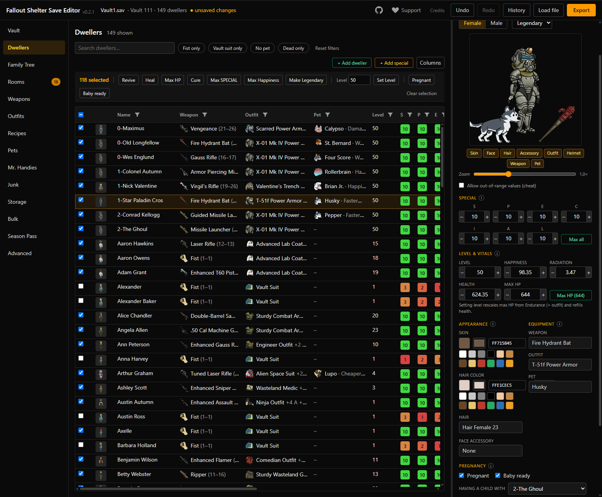
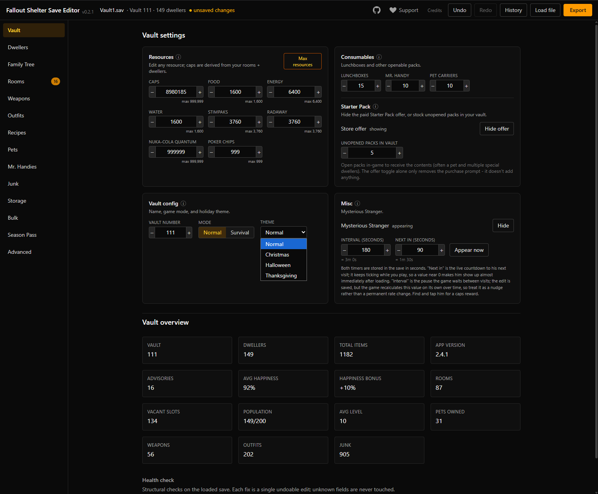
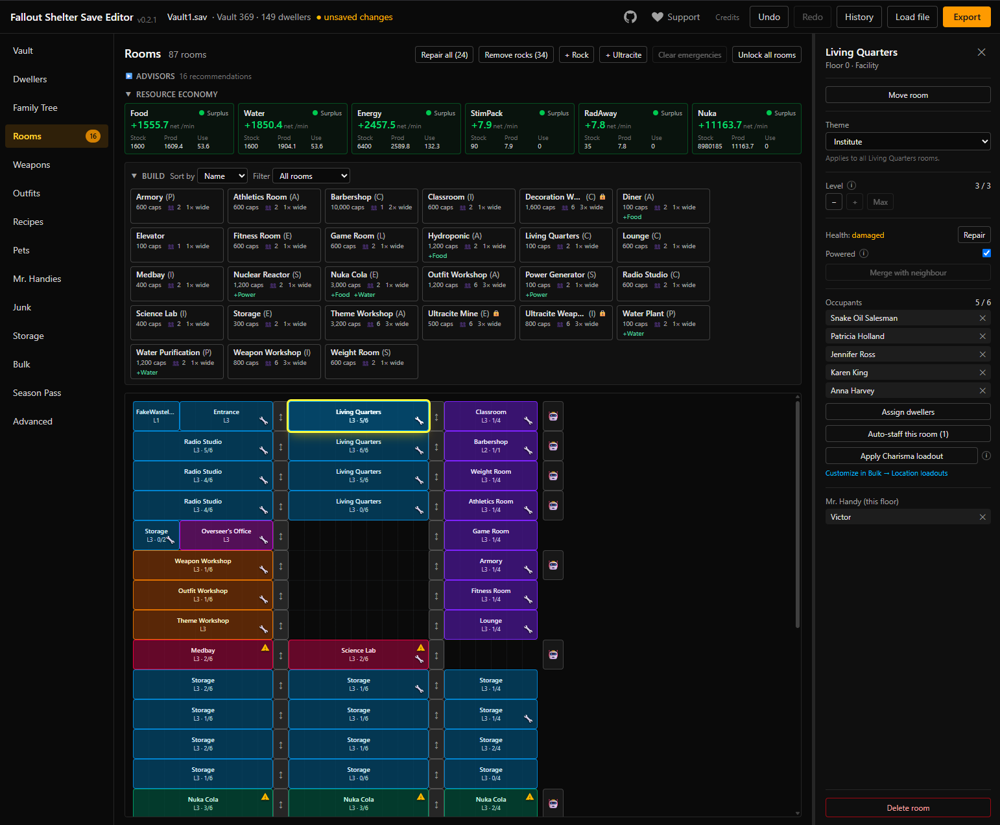
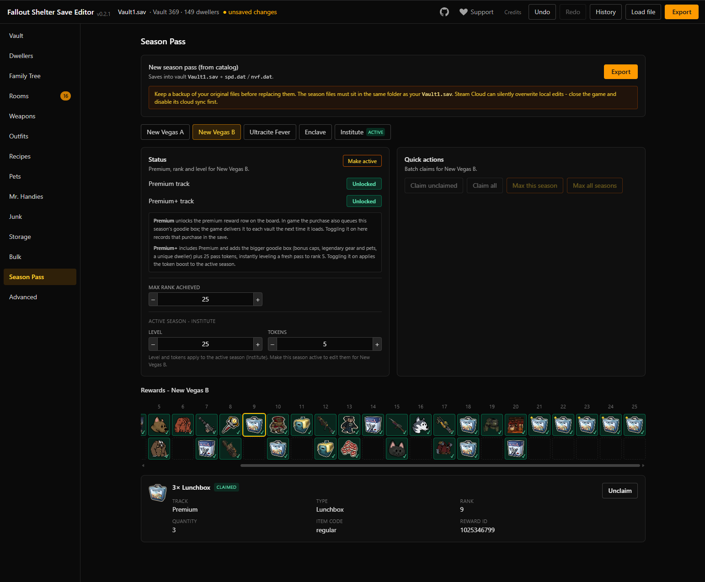
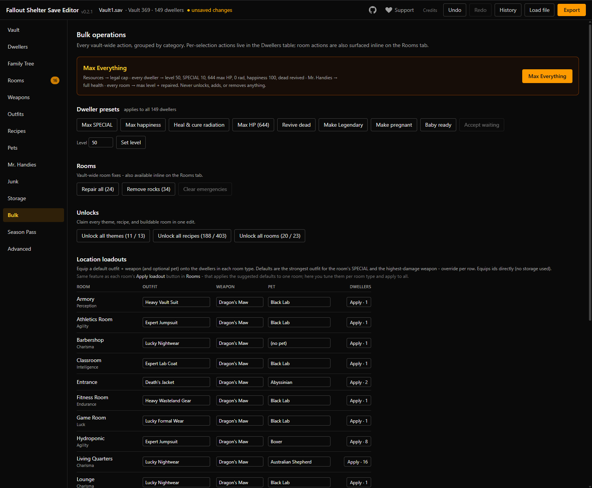
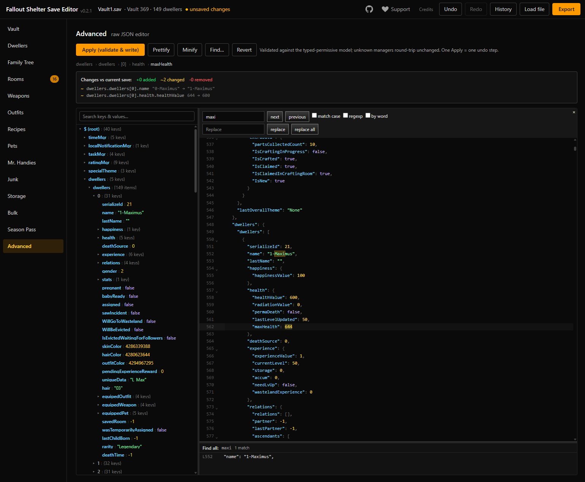

# Fallout Shelter Save Editor

[](https://github.com/dneverson/fallout-shelter-save-editor/actions/workflows/ci.yml)
[](LICENSE)

**Live app: <https://dneverson.github.io/fallout-shelter-save-editor/>**

A client-only web app to view and edit **Fallout Shelter** save files. Load a `Vault<N>.sav`,
inspect and edit your vault, dwellers, rooms, and inventory, then export a working save back to
the game.

**Everything runs in your browser.** Your save is decrypted, edited, and re-encrypted locally;
it is never uploaded to a server.

> **Unofficial fan project.** Not affiliated with, endorsed by, or sponsored by Bethesda. See
> the [Disclaimer](#disclaimer) for the full notice. Editing a save can corrupt it, so always
> keep a backup. Modifying a save may also violate the game's terms of service and could put
> your account or progress at risk; you use this tool at your own risk.

---

## Features

The editor is organized into sections, each backed by undo/redo and live save-health checks:

- **Vault**: vault name, caps, resources (food/water/power/Nuka-Cola), Lunchboxes and other
  consumables, game mode, and the Mysterious Stranger. Disaster toggles for Deathclaw attacks
  and the Bottle & Cappy visit, plus a vault time card with vault-wide fast-forward and
  daily-reward status.
- **Dwellers**: full roster table with SPECIAL stats, level/XP, health, happiness, equipped
  weapon/outfit/pet, name, gender, and appearance; includes bulk name fixes. Location status is
  resolved from real save state (Exploring / Returning / On Quest / At Door / Coffee Break).
  Pregnancy controls can deliver or cancel, restore the imported timer, and force twins or
  triplets; grow-up and exploration timers are editable too. Adding dwellers is capacity-aware
  (fills the living-quarters population cap, then the game's 10-place door queue), special
  named dwellers can be added multi-select in one undo step, and bulk remove scrubs every
  reference the game would (room rosters, training slots, partnerships, wasteland teams,
  orphaned tasks). The population cap itself is derived from your living quarters, as in game.
- **Family Tree**: relationship graph derived from each dweller's parent/lineage data, with
  vault-wide genetics stats.
- **Rooms**: room grid with capacity, production, themes, per-room auto-staff, placement
  validation, and repair, plus work/crafting/training/rush timer editing. Ultracite rooms carry
  a warning that they are inert unless Ultracite Fever is the active season.
- **Weapons / Outfits / Pets / Junk**: catalogs of every game item with icons, sorted/filtered
  views, and add-to-storage with per-row quantity. Weapons and outfits show a Craftable column
  that jumps to the matching recipe.
- **Recipes**: craftable weapon/outfit recipes with rarity and unlock state, plus a detail
  panel (item stats, add/remove from the collection, jump to the item's catalog tab).
- **Survival Guide**: the in-game collection/achievement lists (weapons, outfits, dwellers,
  pets, breeds, junk) with collect/remove and new/seen marking. Anything added elsewhere in the
  editor (storage grants, equips, loadouts, pets, special dwellers) is auto-collected into the
  guide, mirroring the game.
- **Mr. Handies**: owned-robot roster with health and floor assignment editing, plus a catalog
  of the game's variants.
- **Storage**: the vault inventory, with an add-items dialog driven by the game-data catalog
  and multi-select row removal.
- **Quests**: quest and objective catalogs with a questline graph map, a quest detail panel
  with loot and completion editing, and the three daily objective slots as editable cards
  (replace, progress, completed flag, reward lottery, escalation level).
- **Bulk**: vault-wide operations - Max Everything, dweller presets (max stats, heal, and
  more), room operations, unlocks, and location loadouts.
- **Season Pass**: load the game's season files (`spd.dat` / `nvf.dat`) to view the reward
  track and claim or unclaim rewards, up to maxing out every season - including the rerun
  seasons introduced in game v2.5.0. Claims are tracked per vault slot, auto-matched to the
  loaded `Vault<N>.sav` (overridable), so a seasonal vault's board shows its own claim state.
  A season clock card drives the game's own debug offset (+days, skip past the season end,
  reset).
- **Advanced**: a CodeMirror JSON IDE with an explorer tree and a live diff against the
  original save, for direct edits not covered by the structured views.

Other behavior:

- **Automatic backup**: a timestamped copy of your original file is downloaded before your
  first export.
- **Change review**: before export, a dialog summarizes everything changed since import.
- **Save health**: diagnostics run on every edit/undo/redo and surface repairable issues.
- **Cross-platform export**: exported saves are byte-compatible across PC / Android / iOS /
  Switch, and the app shows where each platform stores its `Vault<N>.sav`. (Only the PC path is
  firsthand-verified; mobile/console placement is community guidance.)

---

## Screenshots

The Family Tree, with vault-wide genetics stats derived from each dweller's lineage data:

[](docs/screenshots/family-tree.png)

|                                                                                                     |                                                                                                   |
| --------------------------------------------------------------------------------------------------- | ------------------------------------------------------------------------------------------------- |
| **Dwellers** - full roster with SPECIAL, gear, and appearance editing                               | **Vault** - resources, consumables, game mode, and the Mysterious Stranger                        |
| [](docs/screenshots/dwellers.png) | [](docs/screenshots/vault.png)          |
| **Rooms** - grid with per-room staffing, themes, and repair                                         | **Season Pass** - reward tracks for every season, claim or unclaim anything                       |
| [](docs/screenshots/rooms.png)              | [](docs/screenshots/season-pass.png) |
| **Bulk** - vault-wide presets, unlocks, and location loadouts                                       | **Advanced** - JSON editor with explorer tree and live diff                                       |
| [](docs/screenshots/bulk.png)                     | [](docs/screenshots/advanced.png)           |

---

## Using the editor

1. Open the **[live app](https://dneverson.github.io/fallout-shelter-save-editor/)**.
2. Accept the one-time disclaimer.
3. Load your `Vault<N>.sav` (drag-and-drop or file picker), edit, and export.

### Where to find your save

| Platform             | Location                                                                                                     |
| -------------------- | ------------------------------------------------------------------------------------------------------------ |
| PC (Windows)         | `%LOCALAPPDATA%\FalloutShelter\`                                                                             |
| PC (Microsoft Store) | `%LOCALAPPDATA%\Packages\BethesdaSoftworks.FalloutShelter_<hash>\LocalState\`                                |
| Steam Deck (Proton)  | `~/.local/share/Steam/steamapps/compatdata/588430/pfx/drive_c/users/steamuser/AppData/Local/FalloutShelter/` |
| Android              | `/Android/data/com.bethsoft.falloutshelter/files/` (app-private; needs root/adb)                             |
| iOS                  | App sandbox, `Documents/` (needs a file-sharing/backup tool)                                                 |
| Switch               | Console save-data storage (needs the console's transfer/backup flow)                                         |
| Xbox                 | No direct access; Play Anywhere syncs the cloud save with the Microsoft Store PC build - edit it there       |

Only the PC (Windows) path is firsthand-verified; the others are community-reported guidance
(the app's export dialog shows the same list with per-platform caveats).

---

## Privacy

The disclaimer says it plainly: this tool reads and edits save files entirely in your browser,
and **nothing is ever uploaded.** There is no backend and no telemetry.

---

## For developers

### How it works

A `.sav` file is base64-encoded, AES-256-CBC encrypted JSON with a fixed key and IV:

```
.sav (base64) -> bytes -> AES-CBC decrypt -> UTF-8 -> JSON   (decode)
JSON -> UTF-8 -> AES-CBC encrypt -> bytes -> base64 -> .sav   (encode)
```

The codec preserves the raw JSON structure verbatim, so keys the editor never touches
round-trip with **identical values**. (Whole-file bytes are not guaranteed identical, because
`JSON.stringify` may reorder keys and reformat numbers, but the game re-parses the JSON, so this
is functionally transparent.)

Game-data catalogs (weapons, outfits, pets, junk, rooms, quests, objectives, unique dwellers,
season passes, sprite atlases, and more) live in
[public/gamedata/](public/gamedata/) and are fetched at runtime relative to the app's deploy
base, so the app works mounted at a domain root or a project subpath.

### Tech stack

- **React 19** + **TypeScript** (strict), built with **Vite 8**
- **Tailwind CSS 4** for styling
- **Zustand** for save/UI state; **HashRouter** (react-router) for deep-linkable sections
- **Zod** for save/game-data schema validation
- **PixiJS** for sprite-atlas rendering; **TanStack Table/Virtual** for large roster tables
- **CodeMirror 6** for the Advanced JSON editor
- **Vitest** (unit) + **Playwright** (e2e)

### Development setup

Requires **Node >= 24** and **pnpm** (via Corepack: `corepack enable`).

```bash
pnpm install
pnpm dev          # start the dev server
```

Open the printed local URL, accept the one-time disclaimer, and load a `Vault<N>.sav` file.
See [CONTRIBUTING.md](CONTRIBUTING.md) for the pull-request checklist and commit conventions.

### Scripts

| Command                             | What it does                                              |
| ----------------------------------- | --------------------------------------------------------- |
| `pnpm dev`                          | Start the Vite dev server                                 |
| `pnpm build`                        | Type-check and build to `dist/`                           |
| `pnpm preview`                      | Preview the production build locally                      |
| `pnpm typecheck`                    | `tsc -b --noEmit`                                         |
| `pnpm lint` / `pnpm lint:fix`       | ESLint (zero-warnings policy)                             |
| `pnpm format` / `pnpm format:check` | Prettier write / check                                    |
| `pnpm test` / `pnpm test:watch`     | Vitest unit/integration tests                             |
| `pnpm test:e2e`                     | Playwright end-to-end tests                               |
| `pnpm gamedata:build`               | Regenerate `public/gamedata/` from raw inputs (see below) |
| `pnpm gamedata:refresh`             | Full extraction chain from a local game install           |
| `pnpm gamedata:verify`              | Validate the committed game data (schema/meta/save ids)   |

### Game data

The catalogs in [public/gamedata/](public/gamedata/) are generated offline by
[scripts/build-gamedata/](scripts/build-gamedata/) from game assets extracted with AssetRipper.
The generated JSON is committed, so the app and tests work without any game files. To refresh
it after a game update you need a local Fallout Shelter install; the tooling (including the
AssetRipper release zip) ships in the repo - see [tools/README.md](tools/README.md) and
`pnpm gamedata:refresh`. The extracted assets themselves are never committed.

### Deployment

Merges to `main` deploy automatically: the [Release workflow](.github/workflows/release.yml)
bumps the version from Conventional Commit types, tags it, builds, and publishes to GitHub
Pages. [CI](.github/workflows/ci.yml) (format check, lint, typecheck, tests, build, game-data
verify) runs on every push to `main` and every pull request.

The app is also a plain static SPA for any other host. Vite is configured with `base: './'`
and all runtime asset paths resolve from the deploy base, so the build works whether it is
served from a domain root or a project subpath.

```bash
pnpm build        # outputs dist/
```

Serve `dist/` from your static host of choice.

---

## Acknowledgments

This project was inspired by earlier community save editors:

- [rakion99/shelter-editor](https://github.com/rakion99/shelter-editor): the original
  (AGPL-3.0).
- [erayerm/fs-save-editor](https://github.com/erayerm/fs-save-editor): which the above inspired.

Both motivated this from-scratch, more robust take. This is an independent reimplementation; no
code is copied from those projects.

---

## Disclaimer

This is an independent, non-commercial fan project provided free of charge for personal and
educational use. It is **not affiliated with, endorsed by, sponsored by, or associated with
Bethesda Softworks LLC, ZeniMax Media Inc., Microsoft Corporation, or any of their subsidiaries
or affiliates.**

_Fallout_ and _Fallout Shelter_, and all related names, logos, characters, and imagery, are
trademarks or registered trademarks of Bethesda Softworks LLC and/or ZeniMax Media Inc. Any use
of these names is purely descriptive (nominative fair use) to identify the game this tool
interoperates with, and does not imply any affiliation or endorsement.

This repository includes sprite/icon images and game-data values extracted from Fallout Shelter
for the sole purpose of interoperability (identifying in-game items so a save can be edited
correctly). Those assets remain the property of their respective rights holders. They are not
licensed to you under this project's MIT license, which covers only the original source code in
this repository. If you are a rights holder and object to their inclusion, open an issue and
they will be removed promptly.

This software is provided "as is", without warranty of any kind. Editing save files can
permanently corrupt them. Modifying saves may also breach the game's or platform's terms of
service and could result in penalties imposed by the publisher or platform, including suspension
or loss of your account, achievements, or progress. You use this tool entirely at your own risk
and are solely responsible for backing up your data and for any consequences of its use.

---

## License

MIT for the original source code in this repository. See [LICENSE](LICENSE). Third-party game
assets are excluded from this grant, as noted in the [Disclaimer](#disclaimer).
